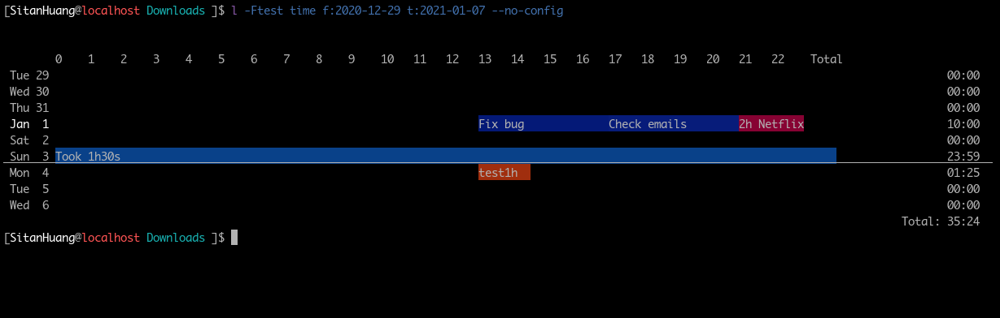
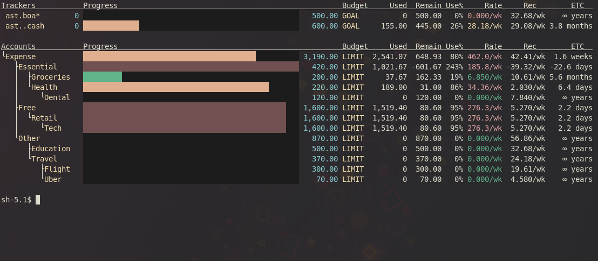
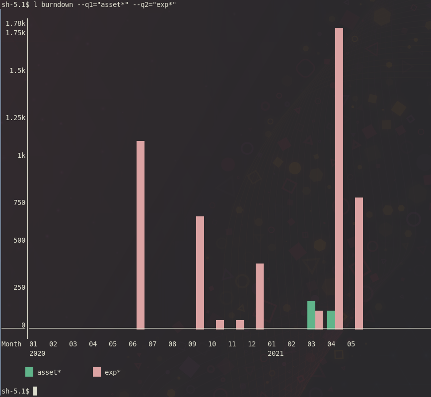
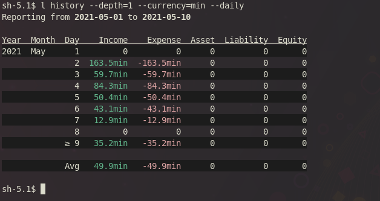

## ledg

- [About](#about)
- [Features](#features)
  * [ledg only features](#ledg-only-features)
  * [Common Ledger Features](#common-ledger-features)
- [Getting Started](#getting-started)
  * [Installation](#installation)
  * [Create a sample journal](#create-a-sample-journal)
  * [Journal Format](#journal-format)
  * [Example Commands](#example-commands)
- [Screenshots](#screenshots)
- [Manual](#manual)


### About
This is a personal project aimed at creating a ledger-like cli accounting program
that I can customize according to my likings and workflow.
For multicurrency journals, the performance is about 7-8 times faster than hledger
and 1.1 times slower than ledger.
[Benchmark](benchmark.md)

The ledg file format is incompatible with other ledger-likes.
It is though easy to switch back and forth by replacing tabs with spaces, etc
There is a built-in print command that can directly be piped into an hledger command.
The program manages the journal for you, and for most of the times one only needs
the `modify`, `edit` and `add` commands.

The project is under active development. [ChangeLogs](ChangeLog.md)

### Features
#### ledg only features
- dependency free
- official vim plugin
  - syntax highlighting
  - snippets
- timeclock timeline chart
- batch modifications
  - `edit` command that pulls up filtered
    entries into a text editor and
    saves your changes
  - `modify` command for batch modifications
  - `add` command that adds entries in
    one line
- git integration
- tracker based budgeting
- transaction tags as JS object properties
- auto file splitting based on year
- very fast: only 1.3 - 1.7 times slower than ledger-cli
  despite using a high level language
- no limitation on decimal places (change DP config in source code)
  as ledg uses a custom bigfloat implementation
- specify precision with cli option

#### Common Ledger Features
- timeclock support
- built in CSV importers (similar to hledger)
- hledger style reports
  - incomestatement
  - cashflow
  - balancesheet
- multicurrency and price table
- envelope based budgeting (virtual accounts)
- smart dates
- book closure
- pending and virtual entries


### Getting Started

#### Installation
MacOS/Linux supported only. Use WSL on Windows.

1. Make sure `node` is in your path.
2. Download and extract the source code from [Releases](https://github.com/SitanHuang/ledg/releases)
   OR download from the [develop](https://github.com/SitanHuang/ledg/archive/refs/heads/develop.zip) branch
   - Note: make install creates a symlink to bin/ledg, which is a js file with
     node shebang and it takes 70ms for node to parse the file; if you want faster
     load times, download a binary from the releases to reduce it all the way to 35ms
3. `make && make install`
4. Put `~/bin` in your path

#### Create a sample journal
`ledg add "Opening Balances" Equity.OpeningBalances 10$ Assets.Cash`

Then

`ledg add .ca -10$ Expense.Uber`

Notice the `.ca` fuzzy matches to Assets.Cash

This will create book.2021.ledg as well as book.config.ledg in your current directory.

Run `ledg` to see balances.

#### Journal Format

```
; add ! for pending entries
; UUID is auto assigned by ledg
YYYY-MM-DD [!] Description [#auto generated UUID]
(2spaces);Property:(inline JSON)
(2spaces)Transfer Description(TAB)Account.Sub1.Sub2(TAB)(Amnt)
(2spaces)(TAB)Account.Sub1.Sub2
```

The entry is basically a JSON object with properties and values that could be used in filters.

#### Example Commands

```
ledg git init
ledg budget edit
# clears all pending entries
ledg modify pending:true --remove-mod=pending
# pulls up system editor to edit cash transactions
ledg edit ..cash from:@year-start
# hledger style incomestatement report
ledg incomestatement --html > Report.html
ledg budget
ledg git commit
```

### Screenshots








### Manual
```
SYNOPSIS
        ledg <command> [ <filter> ] [ <flags> ]

FLAGS
        Presets of flags can be saved at .ledgrc files
        ledg fetches .ledgrc in
                1. $HOME directory
                2. directory of --file
                  a. --file specified by process.argv, OR
                  b. --file specified by ~/.ledgrc
                3. current directory
        after fetching .ledgrc, process.argv is reparsed again, overriding .ledgrc

        --no-config
                do not load .ledgrc files

        --include-prices=A,B,C
                ex: --include-prices=Downloads/USD.db,Downloads/CNY.db
                load listed price files

        --balance-to-currency=CUR
                when reading journals, modifying or adding entries, try to
                convert imbalance or the balance of the last empty transfer
                in CUR

        --file=FILE, -FFILE
                Default: book
                if FILE="-", then ledg reads entries from stdin
                set FILE as a prefix for ledg file locations:
                ex. --file=Documents/book will point to Documents/book.*.ledg

        --light-theme, --lt
                put this in your .ledgrc if your terminal has light background

        --csv,
        --html,
        --format=csv|html
                outputs all tables in different formats(some commands only)

        --csv-no-quotes
                with --csv enabled, output no longer uses quotes around columns

        --csv-delimiter=","
                with --csv enabled, sets csv delimiter

        --right
                place currency right of the amount

        --no-comma
                do not print comma in amounts

        --transpose
                force a table transpose

        --drop,
        --drop-cols,
        --drop-columns=A,B,C,D
                drops columns in tabular outputs

        --budget=NAME
                this can be used in your .ledgrc to point to a default budget
                ex. --budget="Monthly Budget"
                    --budget="2023 Puero Rico Vacation Saving Goals"

        --currency=CURRENCY
                attempts to convert all values to CURRENCY
                Note: in multiperiod reports, sums of each reporting period are
                derived from adding the converted values with rates at the time
                of entries, unless specified by --valuation-date
                Price tables must be included in config.ledg as an array containing
                relative file paths in "data"."priceFiles".
                Price file format is the ledger style price directive

        --valuation-date=yyyy-mm-dd
                specify a date to use for currency conversion

        --valuation-eop, --eop
                in multiperiod reports, use end of period date as valuation date

        --show-default-currency
                do not hide default currency symbol

        --income=<account filter>, --expense=<account filter>, --equity=<account filter>
        --asset=<account filter>, --liability=<account filter>
                Default: Income*, Expense*, Asset*, Liability*, Equity*
                Let certain report commands to know what are the corresponding accounts

        --skip-book-close[=false], --sbc
                Default: false
                Skips all entries with bookClose:"true" or bookClose:true

        -i, --confirm
                Asks for confirmation before adding/modifying entry

        -Wflag1,flag2,flag3
                Example:
                  # turns off everything then turn on imbalanced entries
                  -Wnone,imbalanced-entries

                Flags:
                        invalid-price-declaration,
                        unknown-book-directive,
                        unknown-budget-directive,
                        imbalanced-entries,
                        timeclock-double-checkin,
                        timeclock-checkout-without-checkin,
                        all, # sets everything to true
                        none, # sets everything to false

                Warning: the following only suppress the warning msg and does
                not prevent UUID reassignment; if you don't want ledg to write
                to file, use --do-not-write-books
                        timeclock-uuid-reassigned-warning,
                        uuid-reassigned-warning

        --alias-NAME=ALIAS
                Example: --alias-is="incomestatement --sort --tree"
                replaces name with the alias and reparse argv

EVENTS
        format:
          the event format is similar to that of beancount except that it accepts
          modifiers and transactions as well

          2021-01-01 [!] event type description [#8chruuid]
            ;key:inline json
            desc(tab)account(tab)amount

          event entries can have no transfers, and has the event: modifier set to
          the type so they are queryable with event:.

        workflow:
          ledg add event:type "Description" ... optional transfers and modifiers

          ledg info event:.

TIMECLOCK
        format:
          ; clock in
          i YYYY-MM-DD( |T)HH:MM[:SS] [Account.A.B] [#8chruuid]
          ; clock out (pending)
          o YYYY-MM-DD( |T)HH:MM[:SS] [Account.A.B] [#8chruuid]
          ; clock out (cleared)
          O YYYY-MM-DD( |T)HH:MM[:SS] [Account.A.B] [#8chruuid]
          (2 spaces);attribute:(inline JSON)

        --tc-prices, --tc-prices=false
          Default: true

          loads the following price declarations to pricedb
            P 0000-01-01 m 60s
            P 0000-01-01 h 60m
            P 0000-01-01 d 24h
            P 0000-01-01 h  0$

        --tc-expose
          info command prints generated entries rather than timeclock directives

FILTER
        [ modifiers ] [ account filter, ...]
        a set of arguments that filters entries

        --test=JS code
                the js code is applied with the context of each entry
                Example:
                  --test="transfers.filter(x => x[0].match(/tassel/i)).length"
                  matches entries with transfer description /tassel/i

        --period="smartdate1 [(->?|\.\.\.*| to ) smartdate2]", -Psmartdate
                using sugarjs library to parse date interval
                if only one date is given, only from: will be set
                Examples:
                  - today
                  - next week
                  - last year
                  - the 15th
                  - next Tuesday
                  - 3pm Wednesday
                  - in 30 minutes
                  - in half a year
                  - five years ago
                  - yesterday at 4pm
                  - half an hour ago
                  - an hour from now
                  - 6:30pm in three days
                  - the 4th of July
                  - next week Thursday
                  - the end of February
                  - two weeks from today
                  - the end of next week
                  - next Saturday at 10am
                  - the first day of 2013
                  - four days after Monday
                  - March 15th of last year
                  - two days after tomorrow
                  - the last day of February
                  - Sunday, January 15th 2012
                  - the beginning of this month
                  - the 2nd Tuesday of November
                  - 5-2002
                  - 8/25/1978
                  - 8-25-1978
                  - 8.25.1978
                  - 2012-12-31
                  - 2016-Mar-18
                  - 22 August
                  - April 2012
                  - 1 Dec. 2016

        from:yyyy-mm-dd|smartdate
                limit entries starting from this date(inclusive)
                overrides the start date specified by --period

        to:yyyy-mm-dd|smartdate
                limit entries before this date(exclusive)
                overrides the end date specified by --period

        @min, @max, @year-start, @year-end, @tomorrow, @today, @month-start, @month-end
        @last-year-today, @last-year
                used in conjunction with from: and to:
                ex: "ledg info from:@min to:@max" queries everything in the book

        modifier:regex
                queries entries with modifiers that matches the regex
                ex: payee:"amazon|steam"
                    tag:"pc|tablet"
                setting regex to null will filter entries without such modifier

                shorthands:
                        desc: => description:
                        f:    => from:
                        t:    => to:
                        bc:   => bookClose:

        +TAG
                appends TAG(,|$) to tags: modifier, if tags: is empty

        uuid filter
                uuids can be filtered with the uuid:A|B|C syntax or directly putting uuids as arguments

        account filter
                accounts in ledg follow this format: name[.name...], and name can
                ONLY contain letters and numbers, and MUST contain at least one letter

                ledg support fuzzy search of account names
                        ex: ..cash =~ Account.Current.Cash
                            .cash =~ Account.Cash
                            exp$ =~ Expense
                            exp|inc.sl =~ Expense | Income.Salary
                            exp. =~ Expense.*
                            exp. =~ Expense.*
                        * - matches any character
                        . - matches . literally
                            anything in between dots matches any segments of account names that
                        contains the letters in that order
                            ex: .csh. matches *\.[^.]*c[^.]*s[^.]*h[^.]*\.* in regex

VIRTUAL ENTRIES
        Entries are virtual with virt:true modifier.
        Pass --real flag ignores these virtual entries.

**PENDING ENTRIES**
        Entries are pending with pending:true modifier.
        Pass --cleared flag ignores these pending entries.

COMMANDS
        Commands can be shortened as long as they are not ambiguous
        Example: ledg accounts -> ledg acc
                         ledg info -> ledg inf

        edit <filters> [new]
                brings up system editor to modify filtered entries
                new
                        opens a blank file to manually enter new entries

        accounts add <full account name>
                create new account and write to FILE.config.ledg

        timeline [--max-depth=] [--minhour] [--maxhour] [--simple]
                 [ <filter> ]
                shows blocks of time checked in and out throughout each day
                colors are based on account names

                --max-depth=A
                        truncates account names to level A

                --minhour=A
                        Example: --minhour=14 # 2 pm
                        instead of auto detecting the min hour, set manually

                --maxhour=A
                        Example: --maxhour=14 # 2 pm
                        instead of auto detecting the max hour, set manually

                --simple
                        produces a table of the timeline rather than a graph

        burndown [--q1="[<filters>] <account filters>", --q2=...] [--abs=false] [--count]
                 [--cumulative]
                Creates multi-dataset bar graphs
                Default: --abs=true

                --abs
                        Take absolute values

                --cumulative
                        cumulates count/sum

                --count
                        Show graph of numbers of entries rather than sum

        events [--squash=ymd] [<filters>] [event:"."] [--today=@today]
                Lists events

                --today=yyyy-mm-dd|smartdate
                        Default: @today
                        indicate the date to calculate the "Since" column

                --squash=
                        Default: ymd
                        whether to show year, month and day difference between
                        --today and event date

        close --account=ACC [--income=Income*] [--expense=Expense*]
              [from:@year-start] [to:@year-end] [-i|--confirm=true]
                Moves income and expense balances in a given period to the
                ACC equity account. Create 2 entries with date of to:

                --account=ACC
                        Specify the target Equity account

                -i|--confirm=true
                        Whether to confirm the created entries before adding

                --income=, --expense=
                        Specify the accounts for income and expense

        register [--daily] [--weekly] [--biweekly] [--monthly] [--quarterly]
                 [--yearly] [--hide-zero=true, --hz]
                 [--skip-book-close=true] [--csv] [--invert]
                 [ <account filter 1> <account filter 2> ... ] [--skip=]
                Default: --hide-zero to:@tomorrow from:@min
                displays matched transferse with amounts and a running total.
                Without a reporting interval, individual transfers are shown
                instead of grouping together

                --sort=asc|desc
                        sort entries by amount

                --invert
                        negates all amounts

                --hide-zero, --hz
                        Default: true
                        hide rows that are zeroes when used with reporting interval

                --skip=yyyy-mm-dd|smartdate
                        hides rows up until this date but keep cumulative sum from before

                --csv
                        tabulate data in csv (exporting for other use)

        history [--daily] [--weekly] [--biweekly] [--monthly] [--quarterly] [--invert]
                [--yearly] [--cumulative] [--cumulative-columns=num list] [--avg]
                [--skip-book-close=true] [--epoch] [--csv] [--iso] [--isofull]
                [ <account filter 1> <account filter 2> ... ] [--skip=] [--sum=]
                Defaults: shows accounts specified by --income, --expense, --asset, --liability,
                          and --equity, and defaults --skip-book-close=true
                prints multicolumn time by selected interval
                Note: even with cumulative columns, history command does not sum everything from
                @min, and so unless from:@min is given, asset/liability calculation is not accurate

                --invert
                        invert every number

                --cumulative-columns=1,2,3..., --cml-cols
                        shows cumulative data for the given column numbers

                --avg
                        Default: true
                        shows average over time interval (from: -> to:)

                --sum=1,2,3..., --sum
                        shows sums for columns (--skip -> to:)

                --cumulative, --cml
                        shows cumulative data (from: -> to:)

                --skip=yyyy-mm-dd
                        hides rows up until this date but keep cumulative sum from before

                --epoch
                        show timestamps in epoch

                --csv
                        tabulate data in csv (exporting for other use)

                --isofull
                        show timestamps in ISO date string

                --iso
                        show timestamps in ISO date string

        accounts rename <source> <dist> [ <filter> ]
                modifies entries by replacing account source with dist
                -y
                        defaults confirmations to yes

        balancesheet,
        balancesheetequity,
        cashflow,
        incomestatement [ <filter> ] [--daily] [--weekly] [--biweekly] [--monthly]
                        [--quarterly] [--skip] [from:] [to:] [--hide-zero] [--tree]
                        [--skip-book-close=true] [--iso=true] [--isofull] [--sort]
                        [--sum-parent] [--avg] [ <currency flags> ] [--dp=2]
                        [--csv] [--asset=] [--income=] [--expense=] [--liability=]
                        [--equity=] [--percent|-%]
                displays multiperiod compound reports

                In reports that bring up a historical balance, --skip is replaced
                by from: and from: is set to @min

                --asset=, --income=, --expense=, --liability=, --equity=
                        set the corresponding account filters so that reports
                        can query them

                --sum-parent
                        brings total to parent accounts

                --tree
                        displays in tree view

                --sort
                        sort by amount rather than account name

                --hide-zero
                        hide accounts that have zero sums

                --isofull
                        show timestamps in ISO date string

                --iso
                        Default: true
                        show timestamps in shortened ISO date string

                --percent, -%
                        Displays cells in subreports as a percentage of their
                        column total

        accounts [--tree] [--sum-parent] [--hide-zero, --hz] [--max-depth=NUM, --dep, --depth]
                [--sum] [ <filter> ] [--sort]
                sums balances in selected accounts
                Due to the need to sum entries from the beginning of a book, from: modifier is
                defaulted to @min.

                --sort
                        unless in tree mode, sort accounts by amount in descending order

                --sum-parent
                        allows child account balances to add to parent accounts
                --hide-zero, --hide-zero=false, --hz
                        hide accounts with zero balance or not
                --max-depth=NUM, --depth, --dep
                        max child account depth to show
                --sum
                        sums listed accounts, best used with --max-depth=1
                --tree
                        displays account balances in tree view

        info [ <filter> ] [flat]
                displays entries' information

                flat
                        displays entries row by row rather than expanding individual transfers

        tags [--field="tags"]
                tabulates tags with number of entries

                --field=
                        default: tags
                        This can be used on any fields such as description or payee

        add [--date=yyyy-mm-dd] [-y] [description] [yyyy-mm-dd] [+TAG ...]
            [--default-pending] [*] [!]
            < <account filter>[account description] <amount> [, ...] >
                Note: The last account transfer set can leave empty amount, and ledg will calculate it.
                  ex: "ledg add cash withdrawal from bank ast..cash 100 ast..BoA.chking"
                      will leave Asset.Current.BankOfAmerica.Checking with -100 balance

                !
                        sets entry status to pending

                *
                        sets entry status to cleared

                <account filter>
                        (see FILTER section)

                --date=yyyy-mm-dd, -Dyyyy-mm-dd, [yyyy-mm-dd]
                        Default: current date
                        specifies the date of entry

                --default-pending
                        if set, defaults to pending status; could be overridden
                        with pending:false

                -y
                        defaults most confirmations to yes (unless ledg prompts a list to choose)

        modify <filter> [--date=yyyy-mm-dd] [--add-tag=A,B,C] [--remove-tag=A,B,C]
               [--set-mod=A:123,B:123] [--remove-mod=C,D,E] [-y] [description] [+TAG ...]
               [yyyy-mm-dd] [ <account filter> [account description] <amount> [, ...]]
                batch modify entries, see more in "add" section
                account query is not supported
                Note: using +TAG replaces everything. If only a new tag is needed, use --add-tag

        delete [ <filter> ] [-y]
                batch delete entries
                -y
                        defaults confirmations to yes

        budget [--budget=NAME] [--do-not-adjust] [edit|list] [--simple]
                prints report for the selected budget
                Note: report excludes entries with bookClose:"true"
                      budgets can be edited at FILE.budgets.ledg

                --simple
                        Displays budget with simplified information

                --do-not-adjust
                        By default, if specified from: and to: have different range than the one in
                        budget file, ledg will shrink/grow amounts correspondingly. For example,
                        from:@month-start and to:@month-end on an annual budget will divide all amounts
                        by 12. This option disables the feature.

                edit
                        opens system editor for FILE.budgets.ledg

                list
                        lists all budget names in FILE.budgets.ledg

                Example book.budgets.ledg:
                ~ Vacation Budget 2021
                  ;from:"@month-start"
                ;this is a comment, below are tracker based budgeting
                  ;to:"@month-end"
                  ast.*.Chck        goal 0-500
                  exp.* payee:Amazon        limit 0--200

                ; -- account based budgeting --
                  Expense        300
                ; -- expense cateogries --
                  Expense.Other.Transportation        300
                  Expense.Essential.Groceries        200

        print [<account filters>] [<filters>] [--ledger] [--show-default-currency]
              [--prices|--prices-only] [--pad-spaces=35] [--sort] [--timeclock]
                prints selected entries in ledg format

                can be used in conjunction with -F-
                ex: ledg print lia..amazon | ledg -F- accounts exp..personalcare

                --timeclock
                        when combined with --ledger, allow timeclock formats to
                        replace generated ledger formats

                --sort
                        Default: false
                        sort entries based on date or clockIn:

                --rewrite
                        Rewrites journal files

                        this is useful when combined with --sort to rewrite
                        your journals in correct date order

                --show-default-currency
                        Default: true if --ledger
                        print default currency symbol

                --prices, --prices-only
                        prints price declarations

                --ledger
                        prints ledger & hledger compatible journal

                --pad-spaces=NUM
                        Default: 35
                        with --ledger set, pad NUM spaces between account names
                        and posting amounts

        git [...]
                executes git [...] at the parent directory of FILE

        eval [js] [js]
                executes js code within cmd_eval context

        stats
                displays stats of journal files

        count [<account filters>] [<filters>]
                returns number of entries that match the filters

        export gnucash-transactions > transactions.csv
        export gnucash-accounts > accounts.csv
                csv can be directly imported to gnucash

        import --source=A.csv,B.csv,C.csv --parser=X.js
                read CSV files using parser and add entries to journal

                Parser example:
                  // this is a custom csv parser file
                  // to execute: ledg import --parser=example.parser.js --source=example.csv

                  // ======  optional settings =====
                  delimeter = "|"

                  dateformat = "D/M/YY"
                  // or many formats such as ["YYYY-MM-DD", "M/D/YY"]

                  default_account = "Expense.Unknown"

                  // if error, stop
                  bail = true

                  skip(3)

                  process(() => {
                    // or trim(colNumber)
                    trim()

                    // arguments to call \`ledg add ...\`
                    if (row.length != 3)
                      return
                    if (!col(1).length) {
                      skip(Infinity)
                      return
                    }

                    add(
                      date(col(1)),
                      description(col(3)),
                      cleared(), // or pending()
                      modifier("tags", "IMPORTED"),
                      transfer(
                        // categorize accounts
                        account(
                          col(3),
                          {
                            // regex => acc
                            "hats": "Expense.Clothes",
                            "insurance": "Expense.Insurance"
                          }
                        ),
                        amount(col(2))
                      ),
                      transfer(
                        account("Asset.Bank.Foolbar"),
                        invert(amount(col(2)))
                      )
                    )
                  })
```
