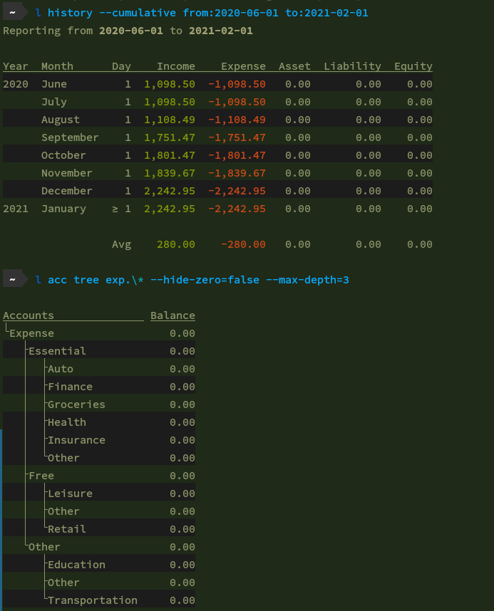
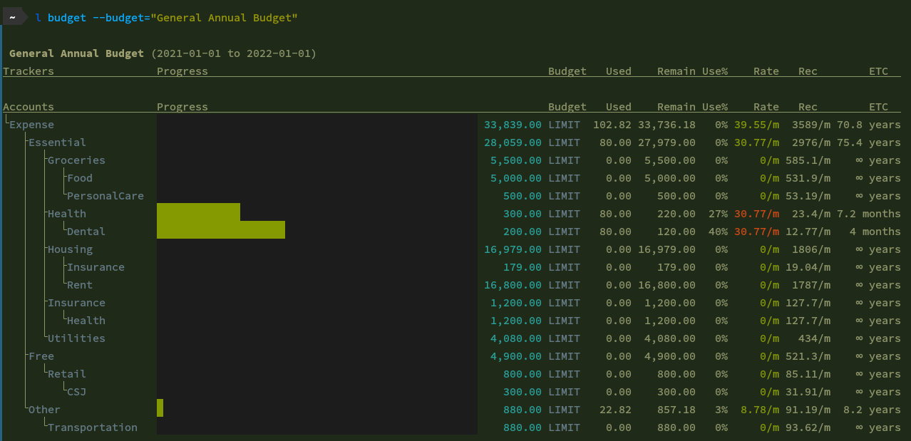
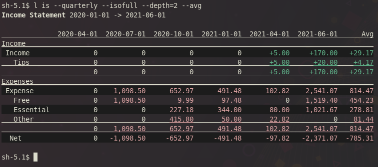

## ledg
This is a personal project aimed at creating a ledger-like cli accounting program, and one that I can customize according to my likings and workflow. It supports fancier reports than ledger and hledger in the cli; it is 25% faster than hledger when benchmarked for reading 10000 entries as it lacks a lot more features such as commodities and price search.

The ledg file format is largely incompatible with other ledger-likes. It is though easy to switch back and forth by replacing tabs with spaces, etc. Ledg also supports descriptions in each transfer as opposed to one description per entry. The program manages the journal for you, and for most of the times one does not need to touch the text files.

### Screenshots




### Manual
```
SYNOPSIS
        ledg <command> [ <filter> ] [ <flags> ]

FLAGS
        Presets of flags can be saved at ~/.ledgrc

        --file=FILE
                Default: book
                set FILE as a prefix for ledg file locations:
                ex. --file=Documents/book will point to Documents/book.*.ledg

        --budget=NAME
                this can be used in your .ledgrc to point to a default budget
                ex. --budget="Monthly Budget"
                    --budget="2023 Puero Rico Vacation Saving Goals"

        --income=<account filter>, --expense=<account filter>, --equity=<account filter>
        --asset=<account filter>, --liability=<account filter>
                Default: Income, Expense, Asset, Liability, Equity*
                Let certain report commands to know what are the corresponding accounts

        --skip-book-close[=false]
                Default: false
                Skips all entries with bookClose:"true" or bookClose:true

FILTER
        [ modifiers ] [ account filter, ...]
        a set of arguments that filters entries

        from:yyyy-mm-dd
                limit entries starting from this date(inclusive)

        to:yyyy-mm-dd
                limit entries before this date(exclusive)

        @min, @max, @year-start, @year-end, @tomorrow, @today, @month-start, @month-end
        @last-year-today, @last-year
                used in conjunction with from: and to:
                ex: "ledg info from:@min to:@max" queries everything in the book

        modifier:regex
                queries entries with modifiers that matches the regex
                ex: payee:"amazon|steam"
                    tag:"pc|tablet"

        +TAG
                appends TAG(,|$) to tags: modifier, if tags: is empty

        uuid filter
                uuids can be filtered with the uuid:A|B|C syntax or directly putting uuids as arguments

        account filter
                accounts in ledg follow this format: name[.name...], and name can
                ONLY contain letters and numbers, and MUST contain at least one letter

                ledg support fuzzy search of account names
                        ex: ..cash =~ Account.Current.Cash
                            .cash =~ Account.Cash
                            exp$ =~ Expense
                            exp|inc.sl =~ Expense | Income.Salary
                            exp. =~ Expense.*
                            exp. =~ Expense.*
                        * - matches any character
                        . - matches . literally
                            anything in between dots matches any segments of account names that
                        contains the letters in that order
                            ex: .csh. matches *\.[^.]*c[^.]*s[^.]*h[^.]*\.* in regex


COMMANDS
        Commands can be shortened as long as they are not ambiguous
        Example: ledg accounts -> ledg acc
                         ledg info -> ledg inf

        edit <filters> [new]
                brings up system editor to modify filtered entries
                new
                        opens a blank file to manually enter new entries

        accounts add <full account name>
                create new account and write to FILE.config.ledg

        burndown [--q1="[<filters>] <account filters>", --q2=...] [--abs=false] [--count]
                Creates multi-dataset bar graphs
                Default: --abs=true

                --abs
                        Take absolute values
                        
                        
                --cumulative
                        cumulates count/sum

                --count
                        Show graph of numbers of entries rather than sum

        history [--daily] [--weekly] [--biweekly] [--monthly] [--quarterly]
                [--yearly] [--cumulative] [--cumulative-columns=num list]
                [--skip-book-close=true]
                [ <account filter 1> <account filter 2> ... ]
                Defaults: shows accounts specified by --income, --expense, --asset, --liability,
                          and --equity, and defaults --skip-book-close=true
                prints multicolumn time by selected interval
                Note: even with cumulative columns, history command does not sum everything from
                @min, and so unless from:@min is given, asset/liability calculation is not accurate

                --cumulative-columns=1,2,3...
                        shows cumulative data for the given column numbers

                --cumulative
                        shows cumulative data

        accounts rename <source> <dist> [ <filter> ]
                modifies entries by replacing account source with dist
                -y
                        defaults confirmations to yes

        accounts [--sum-parent] [--hide-zero] [--max-depth=NUM] [--sum] [ <filter> ] [tree]
                sums balances in selected accounts
                Due to the need to sum entries from the beginning of a book, from: modifier is
                defaulted to @min.

                --sum-parent
                        allows child account balances to add to parent accounts
                --hide-zero, --hide-zero=false
                        hide accounts with zero balance or not
                --max-depth=NUM
                        max child account depth to show
                --sum
                        sums listed accounts, best used with --max-depth=1
                tree
                        displays account balances in tree view

        info [ <filter> ] [flat]
                displays entries' information

                flat
                        displays entries row by row rather than expanding individual transfers

        add [--date=yyyy-mm-dd] [-y] [description] [yyyy-mm-dd] < <account filter>
                  [account description] <amount> [, ...]> [+TAG ...]
                push entry to book
                Note: The last account transfer set can leave empty amount, and ledg will calculate it.
                  ex: "ledg add cash withdrawal from bank ast..cash 100 ast..BoA.chking"
                      will leave Asset.Current.BankOfAmerica.Checking with -100 balance

                <account filter>
                        (see FILTER section)

                --date=yyyy-mm-dd, -Dyyyy-mm-dd, [yyyy-mm-dd]
                        Default: current date
                        specifies the date of entry
                -y
                        defaults most confirmations to yes (unless ledg prompts a list to choose)

        modify <filter> [--date=yyyy-mm-dd] [--add-tag=A,B,C] [-remove-tag=A,B,C]
               [--set-mod=A:123,B:123] [--remove-mod=C,D,E] [-y] [description] [+TAG ...]
               [yyyy-mm-dd] [ <account filter> [account description] <amount> [, ...]]
                batch modify entries, see more in "add" section
                account query is not supported
                Note: using +TAG replaces everything. If only a new tag is needed, use --add-tag

        delete [ <filter> ] [-y]
                batch delete entries
                -y
                        defaults confirmations to yes

        budget [--budget=NAME] [--do-not-adjust] [edit|list]
                prints report for the selected budget
                Note: report excludes entries with bookClose:"true"
                      budgets can be edited at FILE.budgets.ledg

                --do-not-adjust
                        By default, if specified from: and to: have different range than the one in
                        budget file, ledg will shrink/grow amounts correspondingly. For example,
                        from:@month-start and to:@month-end on an annual budget will divide all amounts
                        by 12. This option disables the feature.

                edit
                        opens system editor for FILE.budgets.ledg

                list
                        lists all budget names in FILE.budgets.ledg

                Example book.budgets.ledg:
                ~ Vacation Budget 2021
                  ;from:"@month-start"
                ;this is a comment, below are tracker based budgeting
                  ;to:"@month-end"
                  ast.*.Chck    goal 0-500
                  exp.* payee:Amazon    limit 0--200

                ; -- account based budgeting --
                  Expense       300
                ; -- expense cateogries --
                  Expense.Other.Transportation  300
                  Expense.Essential.Groceries   200

        git [...]
                executes git [...] at the parent directory of FILE
                
        stats
                displays stats of journal files

        count [<account filters>] [<filters>]
                returns number of entries that match the filters
                
        export gnucash-transactions > transactions.csv
        export gnucash-accounts > accounts.csv
                csv can be directly imported to gnucash
```
