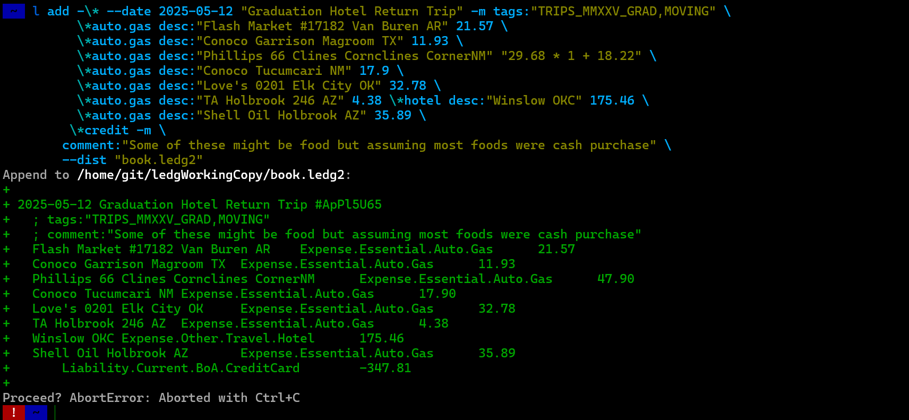
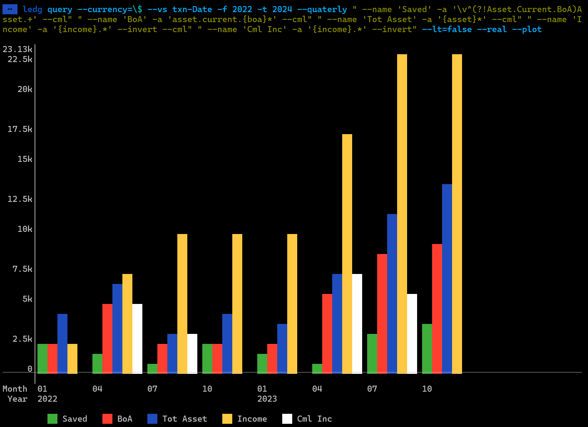
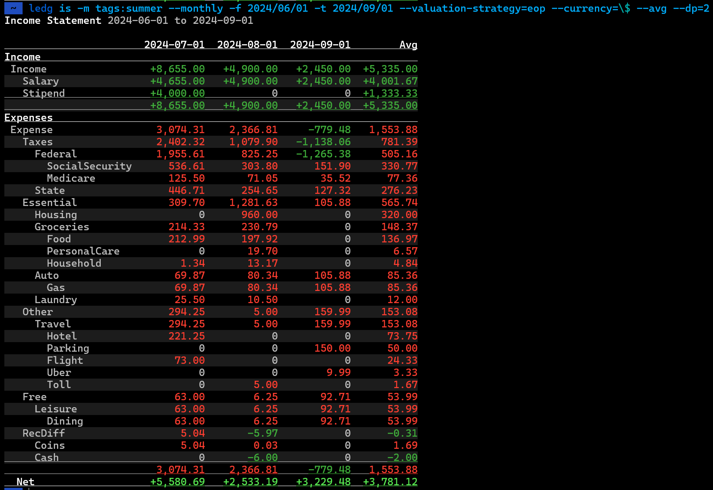
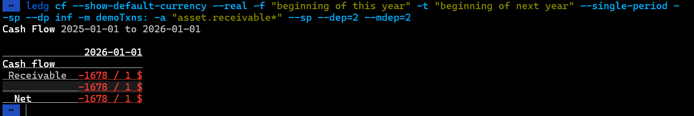

# ledg2

- [ledg2](#ledg2)
  - [Features](#features)
  - [Getting Started](#getting-started)
    - [Install](#install)
    - [Basic Usage](#basic-usage)
  - [Screenshots](#screenshots)

`ledg2` is rewritten from ground up to replace the legacy [v1.0 version](https://github.com/SitanHuang/ledg/tree/ledg1). Most major commands are backwards compatible, and file syntax is completely backwards compatible.

Current v2.0 todos:
- [ ] re-implement v1.0 batch editing commands, now with scoped edits per v2.0 spec
- [ ] recurring transaction generators
- [ ] budgets & trackers
- [ ] explicit balance assertions
- [ ] implement more value expression functions
  - currently, only `floor`, `round`, `ceil` are implemented
  - desired:
    - `evaluate` forces casting of a currency into another
    - `runningBalance` returns the transaction-level running balance at parse time

## Features

- **infinite precision**: numerical values are stored as *rationals in exact form*
- **multicurrency & valuation**
- sensible and ergonomic timestamping & parsing
  - second-level precision with primary & auxiliary dates support down to posting level
  - chronological-order parsing, allowing users to split up directives in multiple files without unintended effects
- **hledger style reports**: incomestatement, balancesheet, cashflow...
- inline **value expression** support: ex. `[1EUR] + round([1 USD] * 1.075, 2)`
- **highly performant**: [~3x faster](benchmarks/benchmark.md) than `hledger` on files with 50k+ transactions
- **rigorous testing**: v2 was written following the test-driven development scheme to make sure all accounting is true and correct. [example integration test](lib/core/integration_tests/queryEngineExecutor.integration.test.ts)
- account opening/closure/reopening mechanisms with rigorous balance assertions
- git integration
- specify JSON-based metadata down to posting level

[Breaking Changes from v1 to v2](https://github.com/SitanHuang/ledg/releases/tag/v2.0.0-alpha)

## Getting Started

### Install

1. Download/clone the repo
2. `npm install`
3. `npm run esbuild` - this produces `bin/ledg2.cjs` with a node shebang
4. If node shebang works on your system, feel free to rename `bin/ledg2.cjs` to `ledg2` and move it to your PATH.
   - If you're on Windows, you can execute `node bin/ledg2.cjs`, or [build your own binary using node SEA.](https://nodejs.org/api/single-executable-applications.html). Pre-built Windows binaries will probably be published on Github in the near future.
5. Copy paste the `vim` directory into your vim install for the smoothest experience of editing ledg files. If using vscode, it is recommended to associate `.ledg` files with *binary* file types.
6. If using the fish shell, copy the autocomplete spec in `autocomplete/ledg.autocomplete.fish` to `~/.config/fish/completions`

Alternatively, you can download a ledg2 Linux binary from the [Releases](https://github.com/SitanHuang/ledg/releases).

### Basic Usage

Use `--help` flag to display subcommand-specific manuals.

Journal files can be placed however you please. The general syntax is as below:
```
; add ! for pending entries
; UUID is auto assigned by ledg
YYYY-MM-DD [!] Description [#UUID]
(2spaces);TransactionProperty:(inline JSON)
(2spaces)Transfer Description(TAB)Account.Sub1.Sub2(TAB)(Amnt)
(2spaces);TransactionProperty:(inline JSON)
(2spaces)(TAB)Account.Sub1.Sub2
```

*The mixture of space and tabs is admittedly quirky and is a legacy design from v1, which was written with the assumption that the user never touches the journal files and only use ledg commands to modify. It is therefore strongly recommended to use the official VIM plugin (follow [Install](#install) guide bulletpoint 5) to work with the whitespaces correctly.*

To add transactions, use the `add` command (just make sure to open the corresponding accounts in journal file first). Example:



More syntax examples:
```
2025-01-01 open Equity.OpeningBalance

; ^ the "open" keyword makes this transaction an opening directive, which is subject
;   to account status and balance assertion checks at runtime

P 0000-01-01 USD 0.9 EUR
P 0000-01-01 13:01:02 USD 0.999 EUR
; ^ price directives

2023-01-01 event bday My Dog's Birthday
; ^ event directives with type "bday" and description "My Dog's Birthday"

2040-01-01 00:00:00 open Asset.Checking.BoA #zea7jjfG
  ;tag:"TAG_IS_A_SPECIAL_METADATA"
  ;jsonMetadataName: {"desc": "any JSON data works as metadata value"}
  	Equity.OpeningBalance
  	Asset.Checking.BoA	-1 * [1 USD] / 3
  ; desc: "^ postings can have their own metadata that overrides that of the transaction"
  ; desc2: " (postings inherit metadata from transaction by default)"

2040-01-01 ! Use exclamation mark for pending/uncleared transactions
; this transaction has no postings

2040-01-01=2024-05-01 Auxiliary date example
  	[Asset.Checking.BoA]	0
  ; ! =2024-05-01 00:01:32
;   ^ postings can override dates & pending status too
;   use brackets to indicate virtual postings (sets virt:true to the posting)

2040-01-01 00:00:01 close Asset.Checking.BoA
  	Asset.Checking.BoA	1 * [1 USD] / 3
  	Equity.OpeningBalance

; we can also include other ledg files:
include years/**/*.ledg
include ./prices/**/*.ledg

```

## Screenshots




