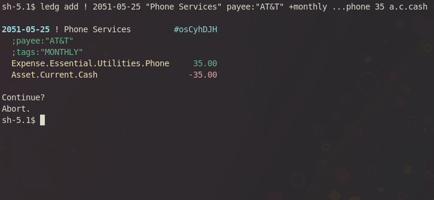

## ledg
This is a personal project aimed at creating a ledger-like cli accounting program, and one that I can customize according to my likings and workflow. The performance is around the same as ledger and hledger.

The ledg file format is incompatible with other ledger-likes. It is though easy to switch back and forth by replacing tabs with spaces, etc. There is a built-in print command that can directly be piped into an hledger command. Ledg also supports descriptions in each transfer as opposed to one description per entry, and multiple currencies in one posting/transfer. The program manages the journal for you, and for most of the times one does not need to touch the text files.

The project is under active development. [ChangeLogs](ChangeLog.md)

### Features
#### ledg only features
- `edit` command that pulls up filtered
  entries into a text editor and
  saves your changes
- `add` and `modify` command that adds entries in
  one line
  - great for automated entries
- scripting via eval command
- git integration
- tracker based budgeting
  - budget with filters rather than accounts
- entry properties as JS object properties
  - faster filtering

#### Common Ledger Features
- multicurrency and price table
- auto file splitting based on year
- envelope based budgeting
- book closure
- similar performance as the ledger-cli

### Installation
MacOS/Linux supported only. Use WSL on Windows.

1. Make sure ``node`` is in your path.
2. Download repository
3. ``make && make install``
4. Put ``~/bin`` in your path

### Screenshots



### Manual
```
SYNOPSIS
        ledg <command> [ <filter> ] [ <flags> ]

FLAGS
        Presets of flags can be saved at .ledgrc files
        ledg fetches .ledgrc in
                1. $HOME directory
                2. directory of --file
                  a. --file specified by process.argv, OR
                  b. --file specified by ~/.ledgrc
                3. current directory
        after fetching .ledgrc, process.argv is reparsed again, overriding .ledgrc

        --file=FILE, -FFILE
                Default: book
                if FILE="-", then ledg reads entries from stdin
                set FILE as a prefix for ledg file locations:
                ex. --file=Documents/book will point to Documents/book.*.ledg

        --light-theme, --lt
                put this in your .ledgrc if your terminal has light background

        --csv
                outputs all tables in csv formats(some commands only)

        --budget=NAME
                this can be used in your .ledgrc to point to a default budget
                ex. --budget="Monthly Budget"
                    --budget="2023 Puero Rico Vacation Saving Goals"

        --currency=CURRENCY
                attempts to convert all values to CURRENCY
                Note: in multiperiod reports, sums of each reporting period are
                derived from adding the converted values with rates at the time
                of entries, unless specified by --valuation-date
                Price tables must be included in config.ledg as an array containing
                relative file paths in "data"."priceFiles".
                Price file format is the ledger style price directive

        --valuation-date=yyyy-mm-dd
                specify a date to use for currency conversion

        --income=<account filter>, --expense=<account filter>, --equity=<account filter>
        --asset=<account filter>, --liability=<account filter>
                Default: Income*, Expense*, Asset*, Liability*, Equity*
                Let certain report commands to know what are the corresponding accounts

        --skip-book-close[=false], --sbc
                Default: false
                Skips all entries with bookClose:"true" or bookClose:true

        -i, --confirm
                Asks for confirmation before adding/modifying entry

        -Wflag1,flag2,flag3
                Sets ignore flags
                Flags:
                        invalid-price-declaration,
                        unknown-book-directive,
                        unknown-budget-directive,
                        imbalanced-entries,
                        all

FILTER
        [ modifiers ] [ account filter, ...]
        a set of arguments that filters entries

        from:yyyy-mm-dd
                limit entries starting from this date(inclusive)

        to:yyyy-mm-dd
                limit entries before this date(exclusive)

        @min, @max, @year-start, @year-end, @tomorrow, @today, @month-start, @month-end
        @last-year-today, @last-year
                used in conjunction with from: and to:
                ex: "ledg info from:@min to:@max" queries everything in the book

        modifier:regex
                queries entries with modifiers that matches the regex
                ex: payee:"amazon|steam"
                    tag:"pc|tablet"

                shorthands:
                        desc: => description:
                        f:    => from:
                        t:    => to:
                        bc:   => bookClose:

        +TAG
                appends TAG(,|$) to tags: modifier, if tags: is empty

        uuid filter
                uuids can be filtered with the uuid:A|B|C syntax or directly putting uuids as arguments

        account filter
                accounts in ledg follow this format: name[.name...], and name can
                ONLY contain letters and numbers, and MUST contain at least one letter

                ledg support fuzzy search of account names
                        ex: ..cash =~ Account.Current.Cash
                            .cash =~ Account.Cash
                            exp$ =~ Expense
                            exp|inc.sl =~ Expense | Income.Salary
                            exp. =~ Expense.*
                            exp. =~ Expense.*
                        * - matches any character
                        . - matches . literally
                            anything in between dots matches any segments of account names that
                        contains the letters in that order
                            ex: .csh. matches *\.[^.]*c[^.]*s[^.]*h[^.]*\.* in regex

VIRTUAL ENTRIES
        Entries are virtual with virt:true modifier.
        Pass --real flag ignores these virtual entries.

COMMANDS
        Commands can be shortened as long as they are not ambiguous
        Example: ledg accounts -> ledg acc
                         ledg info -> ledg inf

        edit <filters> [new]
                brings up system editor to modify filtered entries
                new
                        opens a blank file to manually enter new entries

        accounts add <full account name>
                create new account and write to FILE.config.ledg

        burndown [--q1="[<filters>] <account filters>", --q2=...] [--abs=false] [--count]
                 [--cumulative]
                Creates multi-dataset bar graphs
                Default: --abs=true

                --abs
                        Take absolute values

                --cumulative
                        cumulates count/sum

                --count
                        Show graph of numbers of entries rather than sum

        close --account=ACC [--income=Income*] [--expense=Expense*]
              [from:@year-start] [to:@year-end] [-i|--confirm=true]
                Moves income and expense balances in a given period to the
                ACC equity account. Create 2 entries with date of to:

                --account=ACC
                        Specify the target Equity account

                -i|--confirm=true
                        Whether to confirm the created entries before adding

                --income=, --expense=
                        Specify the accounts for income and expense

        register [--daily] [--weekly] [--biweekly] [--monthly] [--quarterly]
                 [--yearly] [--hide-zero=true, --hz]
                 [--skip-book-close=true] [--csv] [--invert]
                 [ <account filter 1> <account filter 2> ... ] [--skip=]
                Default: --hide-zero to:@tomorrow from:@min
                displays matched transferse with amounts and a running total.
                Without a reporting interval, individual transfers are shown
                instead of grouping together

                --sort=asc|desc
                        sort entries by amount

                --invert
                        negates all amounts

                --hide-zero, --hz
                        Default: true
                        hide rows that are zeroes when used with reporting interval

                --skip=yyyy-mm-dd
                        hides rows up until this date but keep cumulative sum from before

                --csv
                        tabulate data in csv (exporting for other use)

        history [--daily] [--weekly] [--biweekly] [--monthly] [--quarterly]
                [--yearly] [--cumulative] [--cumulative-columns=num list] [--avg]
                [--skip-book-close=true] [--epoch] [--csv] [--iso] [--invert]
                [ <account filter 1> <account filter 2> ... ] [--skip=] [--sum=]
                Defaults: shows accounts specified by --income, --expense, --asset, --liability,
                          and --equity, and defaults --skip-book-close=true
                prints multicolumn time by selected interval
                Note: even with cumulative columns, history command does not sum everything from
                @min, and so unless from:@min is given, asset/liability calculation is not accurate

                --invert
                        invert every number

                --cumulative-columns=1,2,3..., --cml-cols
                        shows cumulative data for the given column numbers

                --avg
                        Default: true
                        shows average over time interval (from: -> to:)

                --sum=1,2,3..., --sum
                        shows sums for columns (--skip -> to:)

                --cumulative, --cml
                        shows cumulative data (from: -> to:)

                --skip=yyyy-mm-dd
                        hides rows up until this date but keep cumulative sum from before

                --epoch
                        show timestamps in epoch

                --csv
                        tabulate data in csv (exporting for other use)

                --iso
                        show timestamps in ISO date string

        accounts rename <source> <dist> [ <filter> ]
                modifies entries by replacing account source with dist
                -y
                        defaults confirmations to yes

        accounts [tree] [--sum-parent] [--hide-zero, --hz] [--max-depth=NUM, --dep, --depth]
                [--sum] [ <filter> ] [--sort]
                sums balances in selected accounts
                Due to the need to sum entries from the beginning of a book, from: modifier is
                defaulted to @min.

                --sort
                        unless in tree mode, sort accounts by amount in descending order

                --sum-parent
                        allows child account balances to add to parent accounts
                --hide-zero, --hide-zero=false, --hz
                        hide accounts with zero balance or not
                --max-depth=NUM, --depth, --dep
                        max child account depth to show
                --sum
                        sums listed accounts, best used with --max-depth=1
                tree
                        displays account balances in tree view

        info [ <filter> ] [flat]
                displays entries' information

                flat
                        displays entries row by row rather than expanding individual transfers

        tags [--field="tags"]
                tabulates tags with number of entries

                --field=
                        default: tags
                        This can be used on any fields such as description or payee

        add [--date=yyyy-mm-dd] [-y] [description] [yyyy-mm-dd] < <account filter>
                  [account description] <amount> [, ...]> [+TAG ...]
                push entry to book
                Note: The last account transfer set can leave empty amount, and ledg will calculate it.
                  ex: "ledg add cash withdrawal from bank ast..cash 100 ast..BoA.chking"
                      will leave Asset.Current.BankOfAmerica.Checking with -100 balance

                <account filter>
                        (see FILTER section)

                --date=yyyy-mm-dd, -Dyyyy-mm-dd, [yyyy-mm-dd]
                        Default: current date
                        specifies the date of entry
                -y
                        defaults most confirmations to yes (unless ledg prompts a list to choose)

        modify <filter> [--date=yyyy-mm-dd] [--add-tag=A,B,C] [-remove-tag=A,B,C]
               [--set-mod=A:123,B:123] [--remove-mod=C,D,E] [-y] [description] [+TAG ...]
               [yyyy-mm-dd] [ <account filter> [account description] <amount> [, ...]]
                batch modify entries, see more in "add" section
                account query is not supported
                Note: using +TAG replaces everything. If only a new tag is needed, use --add-tag

        delete [ <filter> ] [-y]
                batch delete entries
                -y
                        defaults confirmations to yes

        budget [--budget=NAME] [--do-not-adjust] [edit|list] [--simple]
                prints report for the selected budget
                Note: report excludes entries with bookClose:"true"
                      budgets can be edited at FILE.budgets.ledg

                --simple
                        Displays budget with simplified information

                --do-not-adjust
                        By default, if specified from: and to: have different range than the one in
                        budget file, ledg will shrink/grow amounts correspondingly. For example,
                        from:@month-start and to:@month-end on an annual budget will divide all amounts
                        by 12. This option disables the feature.

                edit
                        opens system editor for FILE.budgets.ledg

                list
                        lists all budget names in FILE.budgets.ledg

                Example book.budgets.ledg:
                ~ Vacation Budget 2021
                  ;from:"@month-start"
                ;this is a comment, below are tracker based budgeting
                  ;to:"@month-end"
                  ast.*.Chck        goal 0-500
                  exp.* payee:Amazon        limit 0--200

                ; -- account based budgeting --
                  Expense        300
                ; -- expense cateogries --
                  Expense.Other.Transportation        300
                  Expense.Essential.Groceries        200

        print [<account filters>] [<filters>] [--ledger] [--show-default-currency]
                prints selected entries in ledg format
                used in conjunction with -F-
                ex: ledg print lia..amazon | ledg -F- accounts exp..personalcare

                --show-default-currency
                        Default: true if --ledger
                        print default currency symbol

                --ledger
                        prints ledger & hledger compatible journal

        git [...]
                executes git [...] at the parent directory of FILE

        eval [js] [js]
                executes js code within cmd_eval context

        stats
                displays stats of journal files

        count [<account filters>] [<filters>]
                returns number of entries that match the filters

        export gnucash-transactions > transactions.csv
        export gnucash-accounts > accounts.csv
                csv can be directly imported to gnucash
```
